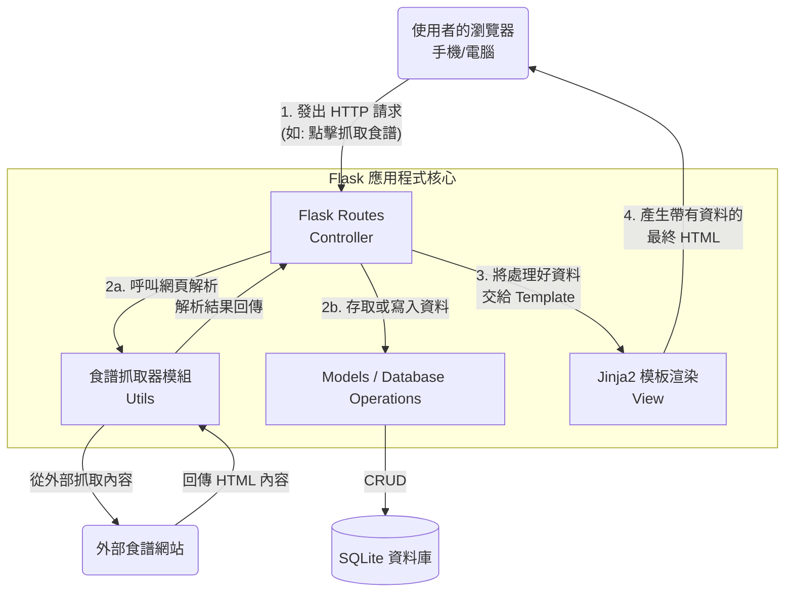

# 食譜收藏系統 - 系統架構設計

## 1. 技術架構說明

本系統以後端渲染為核心架構，為了達成快速啟動 MVP 開發與專注於核心價值的目標，我們選用以下技術棧：

- **後端框架：Python + Flask**  
  原因：Flask 核心輕巧，擁有極大的靈活性。非常適合需要自定義特殊爬蟲需求（抓取各大食譜網站）的業務情境，且能迅速建立 Web 應用服務。
- **模板引擎：Jinja2**  
  原因：與 Flask 具有高度整合性。直接由後端渲染 HTML 頁面傳給瀏覽器，我們不需要為此專案設置複雜的前端框架（例如 React/Vue）以及前後端分離的 API 協定，讓初期開發效率大幅提升。
- **資料庫引擎：SQLite (透過 Python內建 sqlite3 或 SQLAlchemy)**  
  原因：資料結構單純，且輕量易攜帶，無需花費心力設定複雜的資料庫伺服器，適合用在概念驗證階段 (PoC) 或初期開發。

### MVC 模式對應（Model / View / Controller）
- **Model（模型）**：負責與 SQLite 互動，進行食譜的新增、編輯、刪除、及使用者清單、食材庫存查詢。
- **View（視圖）**：由 HTML + CSS + JS 搭配 Jinja2 模板引擎組成，負責呈現資料與介面。
- **Controller（控制器）**：對應 Flask 的 Routes（路由）。接收來自使用者的操作與請求，呼叫對應的 Model 處理資料，並將結果送交 Jinja2 渲染後回傳給使用者。

## 2. 專案資料夾結構

```text
web_app_development/
├── app/                      ← 應用程式主目錄
│   ├── __init__.py           ← 初始化 Flask 應用程式與套件設定
│   ├── models/               ← 資料庫模型 (Model)
│   │   ├── __init__.py
│   │   ├── recipe.py         ← 食譜相關資料庫邏輯
│   │   └── user.py           ← 使用者相關資料庫邏輯
│   ├── routes/               ← Flask 路由 (Controller)
│   │   ├── __init__.py
│   │   ├── recipe_routes.py  ← 食譜抓取、新增、清單處理路由
│   │   ├── cook_routes.py    ← 下廚模式與份量換算相關路由
│   │   └── main_routes.py    ← 首頁、註冊登入等基礎路由
│   ├── templates/            ← Jinja2 HTML 模板 (View)
│   │   ├── base.html         ← 共用版型母體 (Navbar, Footer 等)
│   │   ├── index.html        ← 首頁
│   │   ├── recipe.html       ← 食譜內頁與互動下廚模式
│   │   └── inventory.html    ← 庫存與採買清單介面
│   ├── static/               ← 靜態資源檔案
│   │   ├── css/              ← 樣式設定
│   │   ├── js/               ← 前端互動邏輯 (如步驟切換與螢幕常亮)
│   │   └── images/           ← 系統圖示與上傳圖片
│   └── utils/                ← 輔助功能模組
│       └── scraper.py        ← 萬用食譜抓取器邏輯模組
├── instance/                 
│   └── database.db           ← SQLite 實體資料庫檔案 
├── docs/                     ← 專案設計文件管理
│   ├── PRD.md                ← 產品需求文件
│   └── ARCHITECTURE.md       ← 系統架構設計文件 (本文件)
├── requirements.txt          ← Python 相依套件清單
└── app.py                    ← 整個專案的起始點與應用程式執行入口
```

## 3. 元件關係圖

以下使用系統流程圖說明使用者發出請求後，系統內部的運作流向：



## 4. 關鍵設計決策

1. **優先採用傳統 Server-Side Rendering (SSR) 的完整 MVC 架構**
   - **原因**：為了在初創期最快達成「食譜收集」與「採買清單」核心功能，不花時間建構前後端 API 分離架構，而是讓 Flask 與 Jinja2 直接合作渲染，能大幅降低專案管理複雜度。
2. **特別抽出 `utils` 資料夾存放業務輔助功能**
   - **原因**：為了維持 Controller 路由本身的乾淨，我們將如「食譜抓取器 (`scraper.py`)」這種比較龐大且高度獨立的業務邏輯拆分到 `utils`。這樣做有利於後續如果需要針對各大平台編寫多種解析規則，不會污染核心路由。
3. **選擇行動版優先及原生的 JS 輔助互動下廚模式**
   - **原因**：目標用戶在廚房下廚時通常是使用手機。即使未使用重量級前端框架，我們也要在 `static/js` 裡編寫專用的輕便 JavaScript 以支援下廚模式中的「放大呈現」與「螢幕喚醒 API (Wake Lock)」使螢幕常亮，確保最佳的使用者情境體驗。
4. **採用 SQLite 單檔資料庫做基礎儲存**
   - **原因**：完全本地化的管理使部署及備份極其便利。在 MVP 階段尚未有巨大流量同時寫入時，SQLite 已可完全覆蓋需求並減輕維運負擔。未來若有需要擴展再考慮遷移至 PostgreSQL / MySQL 。
