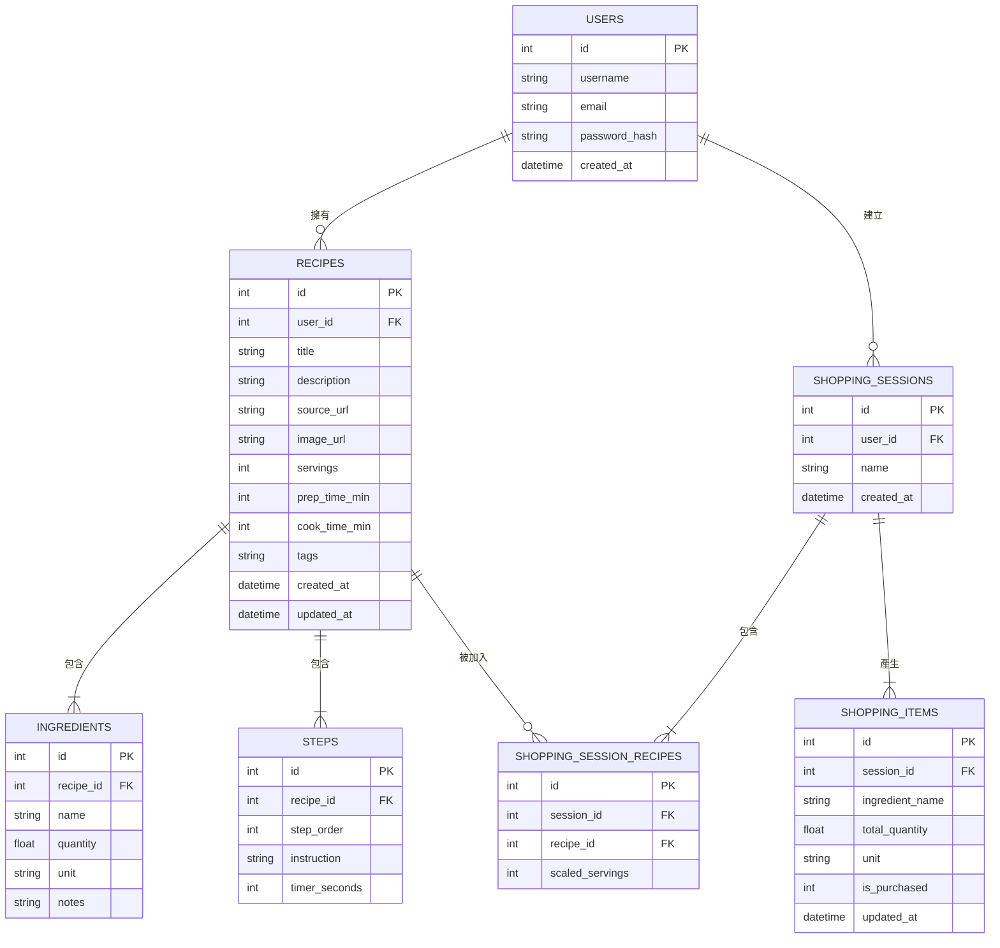

# 食譜收藏系統 - 資料庫設計文件

本文件依據 `PRD.md` 與 `FLOWCHART.md` 設計系統所需的 SQLite 資料庫 Schema，包含 ER 圖、資料表詳細說明、SQL 建表語法與 Python Model。

---

## 1. ER 圖（實體關係圖）

---

## 2. 資料表詳細說明

### 2-1. `users` — 使用者

| 欄位名稱 | 型別 | 必填 | 說明 |
|---------|------|------|------|
| `id` | INTEGER | ✅ | 主鍵，自動遞增 |
| `username` | TEXT | ✅ | 使用者名稱，唯一值 |
| `email` | TEXT | ✅ | 電子郵件，唯一值 |
| `password_hash` | TEXT | ✅ | 雜湊後的密碼（bcrypt / werkzeug） |
| `created_at` | DATETIME | ✅ | 建立時間，預設為當下時間 |

> **PK**：`id`

---

### 2-2. `recipes` — 食譜

| 欄位名稱 | 型別 | 必填 | 說明 |
|---------|------|------|------|
| `id` | INTEGER | ✅ | 主鍵，自動遞增 |
| `user_id` | INTEGER | ✅ | 外鍵，對應 `users.id` |
| `title` | TEXT | ✅ | 食譜名稱 |
| `description` | TEXT | ❌ | 食譜簡介 |
| `source_url` | TEXT | ❌ | 來源網址（透過抓取器新增時填入） |
| `image_url` | TEXT | ❌ | 封面圖片路徑或外部 URL |
| `servings` | INTEGER | ✅ | 原始份數（用於份量換算基準） |
| `prep_time_min` | INTEGER | ❌ | 備料時間（分鐘） |
| `cook_time_min` | INTEGER | ❌ | 烹飪時間（分鐘） |
| `tags` | TEXT | ❌ | 標籤，以逗號分隔（如：`"台式,快炒,省時"`） |
| `created_at` | DATETIME | ✅ | 建立時間 |
| `updated_at` | DATETIME | ✅ | 最後更新時間 |

> **PK**：`id`  
> **FK**：`user_id` → `users.id`（CASCADE DELETE）

---

### 2-3. `ingredients` — 食材

| 欄位名稱 | 型別 | 必填 | 說明 |
|---------|------|------|------|
| `id` | INTEGER | ✅ | 主鍵，自動遞增 |
| `recipe_id` | INTEGER | ✅ | 外鍵，對應 `recipes.id` |
| `name` | TEXT | ✅ | 食材名稱（如：「雞腿」） |
| `quantity` | REAL | ✅ | 數量（如：`2.0`） |
| `unit` | TEXT | ✅ | 單位（如：「支」、「克」、「茶匙」） |
| `notes` | TEXT | ❌ | 備註（如：「去骨」、「切片」） |

> **PK**：`id`  
> **FK**：`recipe_id` → `recipes.id`（CASCADE DELETE）

---

### 2-4. `steps` — 烹飪步驟

| 欄位名稱 | 型別 | 必填 | 說明 |
|---------|------|------|------|
| `id` | INTEGER | ✅ | 主鍵，自動遞增 |
| `recipe_id` | INTEGER | ✅ | 外鍵，對應 `recipes.id` |
| `step_order` | INTEGER | ✅ | 步驟順序（1, 2, 3...） |
| `instruction` | TEXT | ✅ | 步驟說明內容 |
| `timer_seconds` | INTEGER | ❌ | 此步驟的計時秒數（下廚模式計時器用，可為 NULL） |

> **PK**：`id`  
> **FK**：`recipe_id` → `recipes.id`（CASCADE DELETE）

---

### 2-5. `shopping_sessions` — 採買工作階段

| 欄位名稱 | 型別 | 必填 | 說明 |
|---------|------|------|------|
| `id` | INTEGER | ✅ | 主鍵，自動遞增 |
| `user_id` | INTEGER | ✅ | 外鍵，對應 `users.id` |
| `name` | TEXT | ❌ | 採買清單名稱（如：「本週採購」） |
| `created_at` | DATETIME | ✅ | 建立時間 |

> **PK**：`id`  
> **FK**：`user_id` → `users.id`（CASCADE DELETE）

---

### 2-6. `shopping_session_recipes` — 採買清單 × 食譜 關聯表（多對多）

| 欄位名稱 | 型別 | 必填 | 說明 |
|---------|------|------|------|
| `id` | INTEGER | ✅ | 主鍵，自動遞增 |
| `session_id` | INTEGER | ✅ | 外鍵，對應 `shopping_sessions.id` |
| `recipe_id` | INTEGER | ✅ | 外鍵，對應 `recipes.id` |
| `scaled_servings` | INTEGER | ✅ | 此次採買所需份數（用於彙整時換算食材用量） |

> **PK**：`id`  
> **FK**：`session_id` → `shopping_sessions.id`（CASCADE DELETE）  
> **FK**：`recipe_id` → `recipes.id`（CASCADE DELETE）

---

### 2-7. `shopping_items` — 採買清單食材項目

| 欄位名稱 | 型別 | 必填 | 說明 |
|---------|------|------|------|
| `id` | INTEGER | ✅ | 主鍵，自動遞增 |
| `session_id` | INTEGER | ✅ | 外鍵，對應 `shopping_sessions.id` |
| `ingredient_name` | TEXT | ✅ | 食材名稱（彙整後去重複） |
| `total_quantity` | REAL | ✅ | 彙整後的總用量 |
| `unit` | TEXT | ✅ | 單位 |
| `is_purchased` | INTEGER | ✅ | 是否已購買（0 = 未購買，1 = 已購買） |
| `updated_at` | DATETIME | ✅ | 最後更新時間 |

> **PK**：`id`  
> **FK**：`session_id` → `shopping_sessions.id`（CASCADE DELETE）

---

## 3. SQL 建表語法

完整建表語法存放於 `database/schema.sql`（見下方同時建立的檔案）。

---

## 4. Python Model 程式碼

各 Model 檔案位置：

| Model 檔案 | 說明 |
|-----------|------|
| `app/models/user.py` | 使用者 CRUD |
| `app/models/recipe.py` | 食譜、食材、步驟 CRUD |
| `app/models/shopping.py` | 採買工作階段與清單項目 CRUD |

---

> 本文件由 `/db-design` skill 依據 `PRD.md` 與 `FLOWCHART.md` 自動產出。  
> 最後更新：2026-04-28
