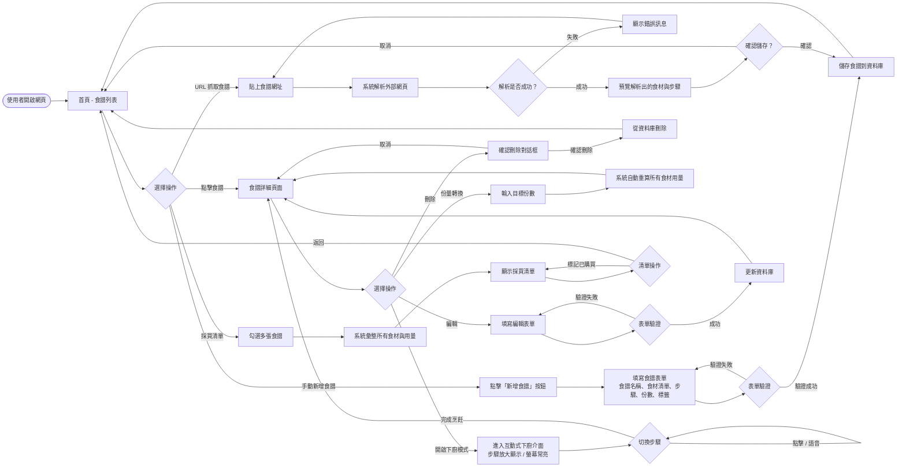
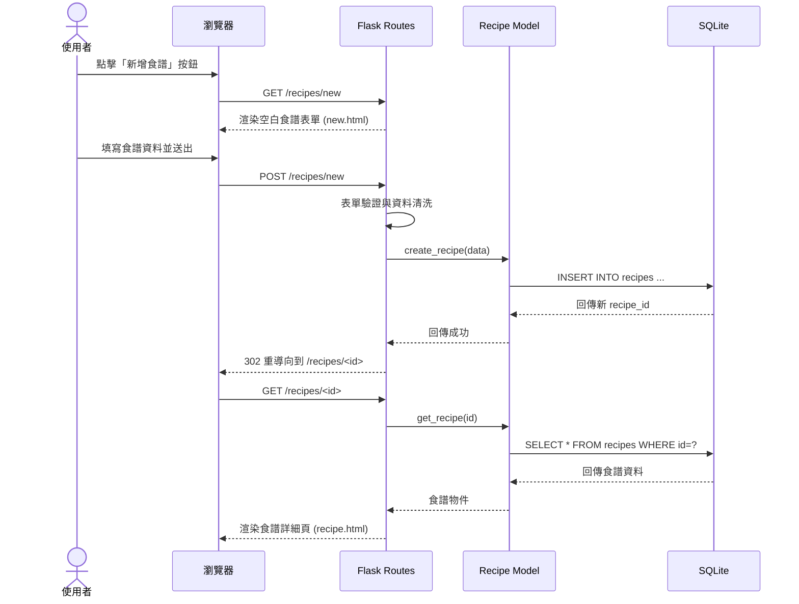
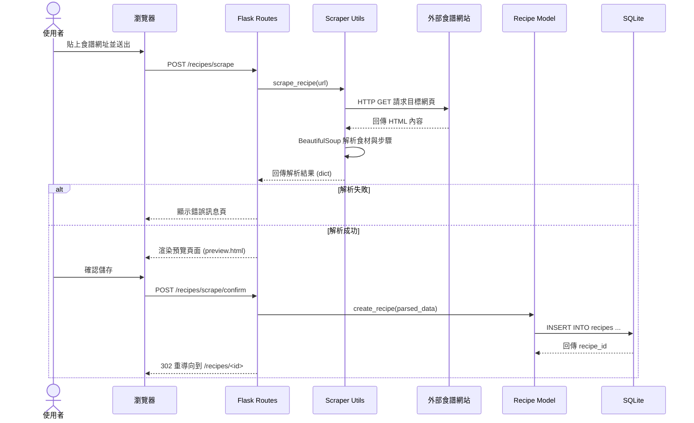
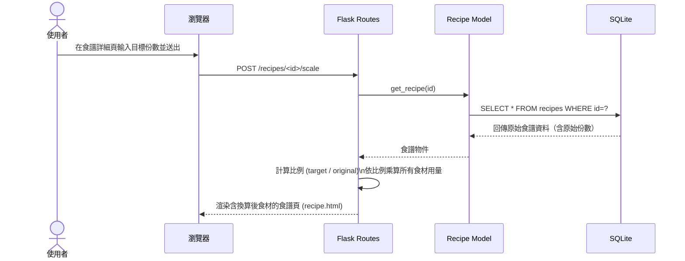
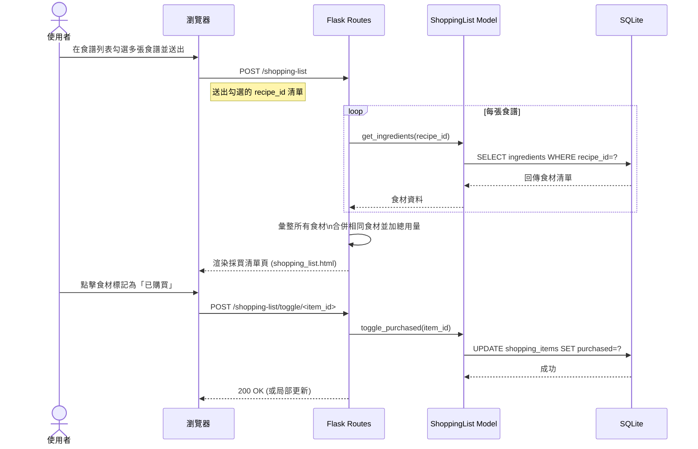
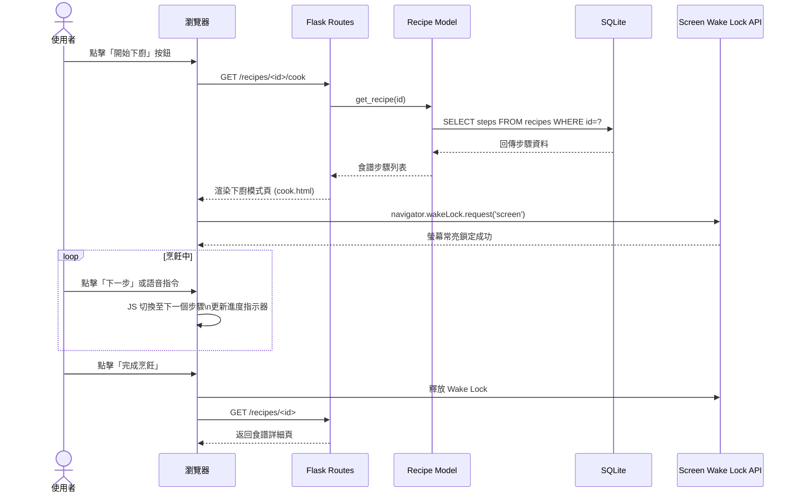

# 食譜收藏系統 - 流程圖設計文件

本文件依據 `PRD.md` 與 `ARCHITECTURE.md` 產出，包含三個部分：
1. **使用者流程圖（User Flow）**：描述使用者的操作路徑
2. **系統序列圖（System Sequence Diagram）**：描述資料在系統內的流動
3. **功能清單對照表**：功能、URL 與 HTTP 方法一覽

---

## 1. 使用者流程圖（User Flow）

以下流程圖涵蓋本系統所有 MVP 核心功能的使用者操作路徑，包含：食譜管理（新增/瀏覽/編輯/刪除）、自動化採買清單、智慧份量轉換、互動式下廚模式，以及萬用食譜抓取器。

---

## 2. 系統序列圖（System Sequence Diagram）

以下序列圖以五個核心功能為主軸，分別描述使用者操作觸發後的完整系統資料流。

### 2-1. 手動新增食譜

### 2-2. 萬用食譜抓取器

### 2-3. 智慧食材份量轉換

### 2-4. 自動化採買清單

### 2-5. 互動式下廚模式

---

## 3. 功能清單對照表

| # | 功能名稱 | URL 路徑 | HTTP 方法 | Controller 路由檔案 | 說明 |
|---|---------|---------|----------|-------------------|------|
| 1 | 首頁 / 食譜列表 | `/` | GET | `main_routes.py` | 顯示所有食譜，支援搜尋與篩選 |
| 2 | 新增食譜頁面 | `/recipes/new` | GET | `recipe_routes.py` | 渲染空白新增表單 |
| 3 | 送出新增食譜 | `/recipes/new` | POST | `recipe_routes.py` | 接收表單資料，寫入資料庫 |
| 4 | 食譜詳細頁面 | `/recipes/<id>` | GET | `recipe_routes.py` | 顯示食譜完整內容 |
| 5 | 編輯食譜頁面 | `/recipes/<id>/edit` | GET | `recipe_routes.py` | 渲染預填資料的編輯表單 |
| 6 | 送出編輯食譜 | `/recipes/<id>/edit` | POST | `recipe_routes.py` | 更新資料庫中的食譜資料 |
| 7 | 刪除食譜 | `/recipes/<id>/delete` | POST | `recipe_routes.py` | 從資料庫刪除指定食譜 |
| 8 | URL 抓取食譜 | `/recipes/scrape` | POST | `recipe_routes.py` | 傳入網址，呼叫 scraper 解析並預覽 |
| 9 | 確認儲存抓取食譜 | `/recipes/scrape/confirm` | POST | `recipe_routes.py` | 確認後將解析結果寫入資料庫 |
| 10 | 份量換算 | `/recipes/<id>/scale` | POST | `cook_routes.py` | 接收目標份數，回傳換算後食材頁面 |
| 11 | 下廚模式 | `/recipes/<id>/cook` | GET | `cook_routes.py` | 進入互動式下廚模式介面 |
| 12 | 採買清單產生 | `/shopping-list` | POST | `recipe_routes.py` | 接收多張食譜 ID，彙整並顯示採買清單 |
| 13 | 標記食材已購買 | `/shopping-list/toggle/<item_id>` | POST | `recipe_routes.py` | 切換食材的已購買狀態 |

---

> 本文件由 `/flowchart` skill 依據 `PRD.md` 與 `ARCHITECTURE.md` 自動產出。
> 最後更新：2026-04-28
